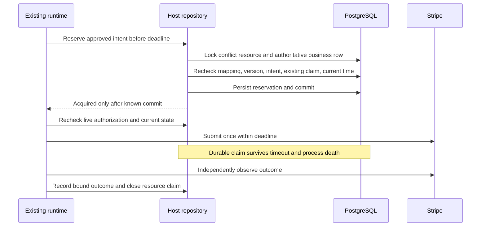
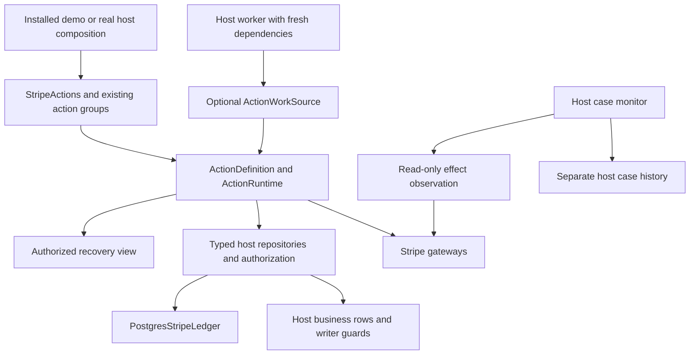

# Deliver governed Stripe actions with host conformance, recovery, and evidence

This is the consolidated implementation plan. It incorporates the original three priorities and all six accepted recommendations from the [review assessment](../product/2026-09-12-reviewer-proposals-assessment.md). That assessment and the [direction research](../product/2026-09-12-direction-research.md) are background; developers do not need to reconcile their task orders with this document. U1–U10 retain their original identities; U11–U17 add or extract work for the final execution sequence below. Proposed interfaces are implementation targets, not claims that these APIs already exist.

## Goal Capsule

- **Objective:** Developers can start with a working Stripe action, adapt it to their application, and understand and operate its failure cases without inventing the lifecycle machinery themselves.
- **Means:** Progressive composition over the existing runtime, reusable PostgreSQL host persistence, executable host qualification, explicit recovery interfaces, evidence export, and a bounded approval-channel recipe (KTD1–KTD13).
- **Scope:** Refunds, period-end cancellation scheduling/withdrawal, and existing credit-note dispositions. Customer adoption evidence is a separate completion gate from implementation verification.
- **Authority:** This document plans the work. It does not authorize running customer operations, contacting outside teams, publishing a new release, or changing production credentials.
- **Execution:** Use the ordered implementation queue, not numeric U-ID order. Reconcile the checkout with current `develop` before editing and work on `develop` as requested for this library. Preserve unrelated changes and public contracts; never force-push. Start with U11. No code or application tests have been run for this planning revision.
- **External dependencies:** An outside host and its owner are required for external qualification. Their absence must not prevent building the recipes and harness, or be represented as successful adoption.

---

## Product Contract

### Summary

Make the three existing Stripe action groups usable through a small first example and progressively replaceable host services. Package the difficult persistence contracts and expose actionable recovery information, then qualify the result against real Stripe sandboxes and an outside application's actual implementation.

### Problem Frame

The domain facade already supplies policy fingerprints, live checks, durable admission, and independent verification. Its constructor still exposes many infrastructure dependencies, and each adopter must implement consequential repository behavior. The PostgreSQL refund web application uses its own `RefundAction` and repository signature, while the newer facade and billing demo use different host contracts. A developer currently has to translate between examples to get a durable implementation of the supported facade.

Recovery has a similar gap. Runtime results distinguish unknown, pending, and unresolved outcomes, but the public read view does not expose scheduling or attempt information. The reference app reads runtime tables directly for due work and owns its own work schedule and cases. Developers must reconstruct operational behavior from several layers.

The desired ease is progressive disclosure of real responsibilities. A short demo can supply fake infrastructure; a production composition must still name authenticated identity, policy, persistence, and custody. Neither should silently choose unsafe defaults.

### Requirements

**Stripe qualification**

- R1. Preserve existing business scope and the meaning of each completion milestone: refund observed succeeded; cancellation scheduled/withdrawn; credit note issued with its required allocation independently verified.
- R2. Qualify all three groups through the same public facade using offline failure scenarios, real PostgreSQL concurrency, Stripe sandbox checks, and recorded outside-host evidence. Report these evidence classes separately.
- R3. Preserve tenant/account binding, policy fingerprints, expiry checks, semantic identity, and conservative treatment of uncertain submission. No new automatic resend path.

**Progressive host integration**

- R4. Provide an installed, credential-free first example using ordinary public action methods in at most 15 executable lines, excluding imports. Disclose supplied demo dependencies and keep the production setup separately visible.
- R5. Let developers replace policy, host repository/authorization, providers, and runtime services independently without changing business request/result models or adopting another lifecycle.
- R6. Supply a PostgreSQL recipe implementing the current three host protocols, including coordination with ordinary application writers and conflicting operations across action groups.
- R7. Supply executable conformance scenarios against adopter-owned repositories and database connections, with safe reports that distinguish passed, failed, and not exercised.

**Recovery**

- R8. Provide an authorized, typed recovery view that explains lifecycle, scheduling, verification progress, and recommended next steps without exposing private snapshots or implying permission to act.
- R9. Provide optional bounded due-work discovery and a documented worker integration that survives lost jobs and duplicate workers using existing runtime admission and verification leases.
- R10. Provide independent post-terminal observation and a host case recipe for late outcomes and operator acknowledgement, preserving historical runtime receipts and consumed intents.
- R11. Present equivalent safe recovery information to direct callers and Pydantic AI tools. Framework approval and model-supplied context cannot become business authority.

**Compatibility and evidence**

- R12. Keep core dependencies limited to Pydantic and the standard library. Keep optional SDKs lazy, preserve existing serialized lifecycle/receipt shapes, and update bundled agent guidance alongside each interface change.
- R13. Publish explicit completion, support, and host-ownership documentation. Record independent adoption honestly under the existing methodology; do not silently replace its formal gates with tutorial success.
- R14. Publish consistent product terminology and supported/experimental entry-point guidance. Preserve existing support/promotion gates and exact-pin upgrade obligations; release frequency is not a proxy for breaking changes.
- R15. Explain when another proposal owns the effect, without leaking that proposal or confusing its state with the caller's proposal. Preserve existing `replayed` semantics and expose richer information additively.
- R16. Export a versioned, authorized, minimized evidence bundle and validate its internal consistency. Distinguish missing evidence from inconsistency; do not claim signatures, audit completeness, or compliance.
- R17. Demonstrate server-bound approval request/callback handling using the existing authenticated HTTP reference surface, preserving identity, audience, assurance, expiry, and live authorization. Third-party channel selection is optional follow-up.
- R18. Produce a pinned AP2 compatibility decision describing trust, role, and business-authority gaps before considering any protocol adapter. No AP2 implementation is required by this plan.

### Acceptance examples

- AE1. An installed-package user runs the short example without Stripe credentials or a database, sees approval required, explicitly supplies demo authority, and obtains an independently verified fake outcome through the regular facade.
- AE2. Two connections attempt a refund and invoice credit sharing a customer billing resource. Only one unresolved reservation is admitted; an ordinary application writer cannot bypass the reference guard. Another customer remains independent.
- AE3. Stripe accepts a mutation and its response is lost. After a worker restart, discovery finds the proposal and reconciliation observes the original effect. Provider mutation count remains one.
- AE4. A refund remains pending. Direct and agent views explain that completion is unproven and show the next check. They do not label a healthy pending refund as a provider outage or suggest another refund.
- AE5. A terminal unresolved proposal later has a matching provider observation. The host case shows the new observation alongside the unchanged original terminal lifecycle. Acknowledging the case does not release the intent for replay.
- AE6. An outside developer implements refunds and then a billing action against their own repository, passes the applicable host scenarios, and explains the difference between submission and completion. Assisted, failed, and unsupported cases remain visible.
- AE7. A distinct losing proposal reports that its effect is already owned. An authorized operator can inspect the winner's current recovery condition; an unauthorized caller gets neither its reference nor its private state. Neither is told a completed result exists merely because `replayed` was returned.
- AE8. An operator exports a pending or unresolved action and sees the original receipts, their attribution, omitted evidence, and any separately attributed late observation. A coherently rewritten unsigned bundle is not claimed to be authentic merely because consistency validation passes.
- AE9. Replaying an approval callback or changing its tenant/proposal fields cannot approve another action. Approval recording does not bypass the existing execute path.

### Scope boundaries

Retain direct-merchant scope for initial qualification. Existing connected-account support remains available and tested for isolation; broader Connect qualification requires an explicit separate matrix. Do not add immediate cancellation, trial/metered/mixed-period subscriptions, cash-refund credit notes, quantity/custom/shipping credit lines, transfer reversals, or application-fee refunds here.

No new workflow engine, generic policy language, ontology framework, hosted dashboard, or autonomous operator. The reference HTTP application exposes recovery, evidence, and approval-request operations; a new graphical operations product is outside this plan. No changes to Threvo's main backend or real customer data are required to implement the library work.

Deferred follow-ups: network/AP2 authority adapter implementation, signed and independently anchored evidence histories, vendor-specific approval transports, nonfinancial connectors, package splitting, generic recovery-case storage, YAML policy loading, and additional database implementations of due-work discovery. U14 must deliver the AP2 study now, and U13 must deliver the concrete first-party approval recipe now; their external expansions are separate work. Existing expert interfaces remain the extension mechanism.

---

## Planning Contract

### Code baseline and research findings

Reviewed source: local `b044271a39a4d7eda34a723645478b485dc66893`; released reference `v0.3.2` at `17e8bb501cb7e68dff5cf78b6640807ec50a1464`. The inspected library source differs only in its version string. The checkout was behind remote `develop`; this plan does not mistake stale local release metadata for a new defect.

| Finding | Grounding | Design consequence |
| --- | --- | --- |
| `StripeActions` already shares one runtime and clock across groups | `src/threvo_actions/integrations/stripe/actions.py` | Add a composition convenience; preserve the constructor and group behavior |
| Refund and billing reservations have equivalent obligations but different snapshot types/status enums | `integrations/stripe/ports.py`, `_operation.py` under `src/threvo_actions/` | Use typed repository adapters over common persistence, without renaming persisted identities |
| PostgreSQL refund app uses `reserve(snapshot, now) -> bool`, its own snapshots, and a separate action | `examples/stripe_refunds/action.py`, `storage.py`, `schema.sql` | Adapt the example to facade contracts; do not present its current repository as directly pluggable |
| Billing demonstrations use process-local `_Intents` | `examples/stripe_billing/demo.py` | Database-backed qualification for both billing groups is new work |
| Runtime terminality and business resolution differ | `runtime.py`, `_LIFECYCLE_DISPOSITIONS`, `stores/base.py` | A terminal unresolved proposal still needs an operational case; preserve immutable history |
| Due work exists in storage but discovery is not in `ActionStore` | `StoredProposal.next_verification_at`, `examples/stripe_refunds/storage.py:due` | Introduce a separate optional discovery capability; preserve custom store contracts |
| EventSink is explicitly best-effort and at-most-once | `src/threvo_actions/receipts.py:EventSink` | Never make events the only source of recovery work |
| Scoped authoring already separates declaration, registration, and per-operation dependencies | `docs/design/gradual-reveal-api.md`, `experimental/application.py`, `integrations/pydantic_ai.py` | Keep dependency lifetimes explicit; do not add global cached sessions or promote experimental names |

The relevant package ranges are Python 3.11–3.13, Pydantic `>=2.10,<3`, Stripe SDK `>=14,<15`, and Pydantic AI `>=2.33,<3`. PostgreSQL CI already covers 15/16 for the store and 16 for the Stripe app. Research against current documentation informs the design; implementation must validate these declared ranges, not assume every current documentation example exists at the dependency floor.

Additional grounding: `runtime.py:ActionRuntime.execute` reloads the losing proposal on `EffectClaimResult.CONFLICT`; `ActionStore.get_effect_claim_owner` already exists in `stores/base.py`. `receipts.py` contains unsigned `internal/v0` records, not a cryptographic chain. `authority.py:AuthorityEvidence` is explicitly insufficient authorization on its own. `examples/stripe_refunds/web.py:create_app` already authenticates configured sandbox bearer identities and exposes `/api/proposals/{proposal}/decision`. `docs/versioning.md` and `docs/testing/gradual-reveal-adoption.md` already define experimental support and promotion; retain them. Local version labels read `0.3.1` because this checkout predates the released metadata; compare current `develop` before calling those labels defects.

### Provider-specific qualification design

**Refunds.** Stripe documents pending refunds, customer-action states, terminal failure, and subsequent failure notifications. Define our milestone as a matching Stripe observation, never a guarantee that a customer's bank account is finally credited. Keep pending/required-action observations nonterminal for the business workflow, preserve the already-correct provisional-absence mapping, and retain a separate late-monitoring record. [Stripe refunds](https://docs.stripe.com/refunds).

**Subscriptions.** Current code intentionally supports active, single licensed-item subscriptions with no schedule, pending update, collection pause, or indirect-charge configuration. Test both schedule and withdraw. Completion proves the requested schedule state and its correlation within the bound billing period; it does not terminate entitlements. Metadata overwritten by another actor or a period rollover can prevent historical proof. Preserve an unresolved result instead of inferring causation from desired state alone. [Stripe cancellation semantics](https://docs.stripe.com/billing/subscriptions/cancel).

**Credit notes.** Preserve exact preview-bound invoice lines, tax/discount calculation, and the two separate allocations. Open-invoice reduction and paid-invoice customer balance credit remain distinct. Verify the referenced customer balance transaction for the latter. Recheck payment/credit drift and test voided notes, mismatched currency/sign/customer, duplicate correlations, and incomplete pagination. Creation must continue suppressing email and specifying zero cash/out-of-band refund allocations. [Stripe credit-note creation](https://docs.stripe.com/api/credit_notes/create), [credit-note preview](https://docs.stripe.com/api/credit_notes/preview).

**Retries and events.** Stripe can prune idempotency keys once they are at least 24 hours old; local consumed intent identity must survive that window. Webhook order is not guaranteed and deliveries may repeat. Keep mutation network retries disabled, use events only to wake an authoritative read, and scope deduplication to the configured account/mode/event. [Idempotent requests](https://docs.stripe.com/api/idempotent_requests), [webhook delivery](https://docs.stripe.com/webhooks).

| Action | Required real-sandbox evidence | Deterministic fault evidence |
| --- | --- | --- |
| Refund | Partial/full refund, exact charge/account/amount lookup, observed outcome | Lost response after successful POST; pending then success/failure; required action; duplicate correlation on a later page |
| Cancellation schedule | Active supported subscription gains the approved cancellation schedule | Expiry during reservation; permission revoked after lock; metadata/period drift; unproven readable state |
| Cancellation withdrawal | Existing schedule is withdrawn before its deadline | Independent schedule writer; period rollover; ambiguous update response |
| Invoice reduction | Exact preview/create/retrieve against an open finalized invoice | Invoice payment races; changed tax/discount preview; incomplete lines; duplicate credit correlation |
| Customer balance credit | Paid-invoice credit note and independently retrieved balance transaction agree | Wrong balance amount/sign/customer; missing transaction; note voided before/after initial verification |

Real sandbox runs cannot be assumed to reproduce every network or banking outcome. Fault injection belongs at the gateway/transport boundary and is labeled separately. Billing test clocks help with period transitions; the runtime clock remains independently injected. [Stripe sandbox testing](https://docs.stripe.com/testing), [billing test clocks](https://docs.stripe.com/billing/testing/test-clocks).

### Key technical decisions

- KTD1. **One facade and runtime, with additive composition.** Introduce a frozen dataclass `StripeServices` under the optional Stripe integration to bundle existing live services, and `StripeActions.from_services` to compose configured groups. Add a `RefundConfig` symmetrical with the existing billing configs for this entry point. Existing constructor calls stay valid. No new core service container or execution profile is needed.
- KTD2. **Demo convenience is explicit.** Put credential-free scenario factories in `integrations/stripe/testing.py`. They provide fake gateways, in-memory repositories, a clock, and ephemeral protection and return the actual `StripeActions` facade. They cannot accept a real Stripe client, enable live mode, or silently become production setup. The installed-package example reveals exactly what it supplies.
- KTD3. **Package bookkeeping; keep business truth in the host.** Add `PostgresStripeLedger` in `integrations/stripe/postgres.py` for immutable intent identity, reservation records, and opaque protected-snapshot storage. Concrete reference repositories live in `examples/stripe_host/` and implement the current three public protocols. Their resource mappings, authorization, business tables, and writer guards remain inspectable host code.
- KTD4. **Durable business reservation spans the provider call; SQL locks do not.** Reservation commits before dispatch. A persistent resource claim prevents other cooperating writers from acting after the short transaction ends. The example uses a conservative customer billing resource shared across all three groups; custom hosts can narrow conflict sets only with equivalent conformance evidence. PostgreSQL row locks alone end with the transaction. [PostgreSQL locking](https://www.postgresql.org/docs/16/explicit-locking.html).
- KTD5. **Recovery is an additive view.** Add `ActionRecoveryView`, `ActionRecoveryStep`, and `ActionRecoveryCondition` in `recovery.py`, exposed by `read_recovery` on the runtime and each Stripe group, following their existing `read` argument conventions. Leave `ProposalView`, `ActionOperationResult`, receipt schemas, and lifecycle enums unchanged. The view describes options; runtime methods still decide whether an operation may proceed.
- KTD6. **Discovery is optional and authoritative.** Add a separate `ActionWorkSource` Protocol and a PostgreSQL implementation alongside `PostgresActionStore`. It returns bounded safe work references, not snapshots. The first worker recipe routes only statically configured action types and calls existing runtime methods. EventSink is never a durable queue.
- KTD7. **Late observation is separate from lifecycle settlement.** Each Stripe group gains an explicitly read-only `observe_effect` operation that authenticates read context, binds the persisted intent, and performs provider verification without recording a runtime transition or releasing the host reservation. Host-owned case records store new observations and operator acknowledgements separately. This avoids reopening terminal states or changing receipt history.
- KTD8. **Pydantic models describe data; typed Python objects own resources.** Recovery/configuration/report boundaries use strict, frozen models, immutable collections, and explicit discriminators. Dependencies remain dataclasses/Protocols. Preserve per-call dependency binding where the host uses scoped sessions. Pydantic AI already supports typed dependencies and test overrides, and distinguishes approval from server authorization. [Dependencies](https://pydantic.dev/docs/ai/core-concepts/dependencies/), [deferred tools](https://pydantic.dev/docs/ai/tools-toolsets/deferred-tools/), [Pydantic model immutability](https://docs.pydantic.dev/latest/concepts/models/#faux-immutability).
- KTD9. **Ship one complete refund path first.** Shared contracts account for all existing group types, but U3/U4/U7/U8/U9 first deliver refunds. U15 completes billing repositories, installed scenarios, late observations, and sandbox coverage. Billing semantics and regression fixes remain in U1 from the start.
- KTD10. **Preserve compatibility without premature promotion.** The supported facade and `Action` are entry points; `ActionApplication` remains conditional and experimental until its existing evidence gates pass. Use “Threvo Actions — governed actions for consequential application changes” consistently. No package rename or arbitrary release freeze.
- KTD11. **Evidence consistency is not provenance.** Add a separately versioned allowlisted bundle over existing records, with exact embedded receipt versions and explicit limitations. No core receipt rewrite, signing key store, or trust claim is introduced.
- KTD12. **The first approval transport is already present.** Extend the authenticated reference HTTP application with persisted approval-request correlation and idempotent callbacks. Keep its bearer identities sandbox-only; a production host supplies its own authenticated principal resolver. No HumanLayer or Slack SDK is selected without a consuming host.
- KTD13. **AP2 is a research deliverable, not a new execution rail.** Pin the official specification revision and establish the consumer role, cryptographic verification, local identity mapping, and authorization gaps. A valid purchase mandate does not inherently authorize a refund. Current official terminology is Checkout and Payment mandates. [AP2 specification](https://ap2-protocol.org/ap2/specification/), [authorization framework](https://ap2-protocol.org/ap2/agent_authorization/).

### Progressive customization contract

| Layer | Developer supplies | Library/recipe supplies | Customization escape |
| --- | --- | --- | --- |
| 0: See a complete action | Scenario choice and explicit demo approval | Actual facade with fake dependencies, deterministic clock, safe diagnostics | Replace one dependency to move to the next layer |
| 1: Run against Stripe sandbox | Test client, host identity/policy, PostgreSQL and custody configuration | Concrete host recipe and three repository implementations | Existing group config and service fields |
| 2: Integrate existing application | Authoritative business mappings and authorization; writer coordination | Shared ledger primitives, conformance driver, recovery view/discovery | Implement the existing repository Protocols |
| 3: Customize infrastructure | Custom stores, gateways, clocks/events/custody | Stable action request and result semantics | Existing direct constructor and public ports |
| 4: Author different semantics | Custom action behavior or scoped recipe | `Action`, expert definitions/runtime, existing experimental application | No rewrite of the lifecycle engine |

The short example should visibly perform preparation, observe the need for approval, record demo authority, execute, and reconcile using the same public methods used in the real application. A “run everything” shortcut that hides approval and verification does not satisfy R4. Document imports and full infrastructure setup adjacent to the short example; the line budget measures the demonstration, not production integration cost.

`StripeServices` contains the existing store, authority evaluator, commitment provider, protection codec, optional retention store, clock, identifiers, event sink, and runtime revision. It borrows their lifetime and never creates/closes them. Policy and host identity remain action-group concerns. `from_services` accepts one SDK client or configured custom gateways under the same exclusivity rules as today. It creates one shared runtime exactly as the current constructor does.

The installed scenario factory returns a frozen fixture object containing the real facade, public command/context values, and an explicitly named demo approval helper. The helper only creates bound fake authority; it does not execute or reconcile. A user invokes `prepare`, inspects the result, records that evidence with `record_authority`, then invokes `execute` and `reconcile`. Moving from the fixture to `from_services` replaces infrastructure while preserving these calls. The 15-line budget applies to that visible lifecycle, not to production provisioning.

A host using a request-scoped database session constructs its binding inside that scope. The reference recipe uses application-owned pools and short transactions, so a long-lived facade does not capture an open transaction. Preserve the existing experimental `ActionApplication`/`ScopedActionToolBinding` path for finer scope control; do not invent a new agent lifecycle or require it for the first Stripe integration.

### Host persistence and conformance design

The package ledger's proposed namespace is `threvo_stripe_host`, with its own explicit migration entry point and privileges. Do not add host business tables to the core runtime migrations. The host recipe owns a separate example business schema. `PostgresStripeLedger` does not claim that an unregistered application table participates in its locks.

The critical transaction seam is explicit: the host repository acquires one connection and opens one transaction, locks its conflict/business rows, rechecks authoritative state, and calls ledger reservation bookkeeping on that same connection. Provide `reserve_in` and `close_in` operations that require an active caller-owned transaction; they neither acquire another connection nor commit it. The host returns `ACQUIRED` only after the outer transaction commits. Pool-backed remember/load helpers may own separate short transactions. Outcome closure and any related host business-row update use the same caller transaction. This prevents a convenience ledger from accidentally splitting the atomic business comparison from its durable claim.

Expose `migrate_stripe_postgres` and `stripe_postgres_migration_status` in the optional Stripe migration module. Constructors do not migrate. Reserve resource identifiers through the host mapping, never arbitrary SQL identifiers supplied by action commands. New core work-discovery indexes, if required, use the next unused core migration version discovered at implementation time; existing migration files/checksums remain immutable.

| Record | Required information and invariant |
| --- | --- |
| Intent | Tenant, stable effect reference, action group, immutable requester binding, versioned protected snapshot, immutable snapshot fingerprint. Identical remember is idempotent; changed rebinding fails |
| Resource claim | Tenant plus host-resolved conflict resource; owning intent; durable reservation timestamp. At most one unresolved owner per resource |
| Closure | Known no-submission or independently observed result, with bound observation reference. Closing releases the resource but retains consumed intent identity |
| Work scheduling | Proposal reference, next attempt, bounded worker lease/token. Operational throttling only; never replaces runtime admission |
| Case and observations | Host-owned proposal/effect linkage, append-only observation/acknowledgement records, next monitoring time and retention deadline. No free-text provider payloads in public projections |

Reference reservation sequence:

Reference resource mapping is host-owned: payment, invoice, and subscription rows map to one customer billing resource within the tenant and Stripe account. Refunds currently have no customer field in `RefundPayment`; the host performs that mapping without changing its public snapshot schema. Missing mapping refuses reservation. Different customers can proceed concurrently. Resource identity must survive business-key aliases; two aliases for the same invoice cannot acquire independent claims.

Ordinary business updates take the same resource lock and check the durable claim. The reference schema also protects relevant update/delete/reparent operations with guards, covering direct SQL writes. Lock order is consistent across operations. After a wait, re-read authoritative business state and compare an advancing database clock to the supplied deadline; `CURRENT_TIMESTAMP` is fixed at transaction start and is unsuitable for this final elapsed-time check. Test against supported PostgreSQL 15/16. [PostgreSQL time functions](https://www.postgresql.org/docs/16/functions-datetime.html).

If reservation commit acknowledgement is lost, retain uncertainty and reconcile; never convert it to `UNAVAILABLE` or delete the claim. A durable reservation means “submission may have happened,” even if a crash occurred before the POST. Timeout alone cannot reopen it. Deterministic `record_no_submission` is available only when the running executor knows it did not dispatch.

Host outcome recording and runtime settlement are separate writes. Make `record_outcome` idempotent when observation repeats after a failed runtime write. Release a resource only by comparing its current owning intent; an old observation must never release a newer owner's claim. Keep consumed intent identity after closure. Conformance must exercise this failure boundary without assuming a distributed transaction. Ordinary application roles cannot directly edit ledger claims or disable writer guards; migration privileges remain separate.

Protect stored snapshots with host-owned custody and context binding to tenant/intent/purpose. The package ledger stores opaque envelopes, not raw provider identifiers or arbitrary JSON snapshots. The reference protection recipe reuses the existing envelope-encryption primitives with a separate intent purpose; it does not misrepresent an intent as a runtime proposal. Credential material remains outside the ledger. Retention covers host copies and case evidence as well as runtime payloads; consumed non-sensitive intent tombstones survive content erasure.

No local lock provides compare-and-set against Stripe Dashboard or another integration. Document the remaining provider read/write race, test out-of-band changes, and require exact verification. Never advertise external-writer atomicity.

`StripeHostConformanceDriver` is a typed test boundary supplied by the adopter. It creates isolated fixtures, opens independent connections, changes an authoritative binding through the ordinary writer, simulates acknowledgement loss, observes submission counts, and cleans up only its owned fixture scope. Mandatory capabilities must be exercised to pass; absent capabilities produce `not_exercised`. Reports contain scenario IDs, exact package/source and fixture revisions, action group, result, and sanitized evidence references—not DSNs, raw exception text, snapshots, or credentials. Assertions use the real repository implementation; provider outcomes may be supplied by a deterministic gateway.

### Recovery API and behavior

`ActionRecoveryView` contains schema version, proposal reference, lifecycle status, revision, erased flag, observation time, proposal expiry, next verification time, attempt count/limit, last verification status, a safe reason code, and recommended steps. It adds no authority token. Derived conditions distinguish waiting on authority, ready for execution, active execution lease, waiting on provider completion, unavailable observation, unproven outcome, operator attention, and resolved outcome.

The runtime reads the record and performs the same `can_read` check as `read`. Missing, wrong action type, or denied access keep the existing masked-not-found behavior. Erased/pending-erasure results contain a minimal tombstone and no scheduling/evidence details. A new optional API avoids breaking strict consumers of existing response models.

| Stored condition | View and recommended next step | Prohibited inference |
| --- | --- | --- |
| Awaiting authority before expiry | Await authority | Approval exists because the agent says so |
| Awaiting authority/authorized after expiry | Expire proposal | Submit because it used to be authorized |
| Authorized and unexpired | Request execution; live checks still apply | Displayed recommendation grants permission |
| Authorized but effect owned by another proposal | Inspect permitted owner recovery; otherwise explain ownership prevents dispatch | `replayed` guarantees a result exists or grants access to the sibling |
| Executing before lease deadline | Wait until next check | Another worker may dispatch |
| Executing after lease, failed unknown, or due verification pending | Reconcile | Missing response means no effect |
| Future verification pending | Wait; expose next check | Healthy pending means provider outage |
| Verification unresolved or partial result | Operator review; independent observation if retained | Terminal means business outcome is settled |
| Verified/known failure | Show recorded outcome; separate monitoring if configured | Original outcome can be silently rewritten |
| Stale/superseded | Review replacement linkage where present; prepare again only through normal flow | Old authority transfers to a new proposal |
| Denied/blocked/expired | Explain refusal; no automatic execution | New proposal or new intent is automatically safe |
| Erased | Minimal tombstone | Retained host data is permission to recover erased private evidence |

Reasons come from durable receipts and closed library classifications. Host-defined reason codes remain safe references; never derive user-facing advice by string-parsing arbitrary exceptions. Preserve the distinction between a failed authoritative query and a successful query that did not prove the expected effect. In particular, characterize the subscription verifier's current readable-but-unproven `TARGET_UNAVAILABLE` result and change it to provisional absence when the binding itself is valid. Invalid/malformed/incomplete observations remain fail-closed with an explicit observation problem; do not claim final absence.

`ActionRecoveryView` includes an effect-ownership relation: unclaimed, owned by this proposal, owned elsewhere, or observation uncertain. An optional minimized owner view carries reference, revision, lifecycle/condition, and next-check time only after a separate `can_read` check for that exact owner. Never copy the owner's result into the loser's operation result or infer access from tenant equality alone. Re-read owner identity when the observations conflict; a bounded retry can produce uncertainty, never a loop or invented coherent snapshot. Suppress the generic execution recommendation whenever another intent owner prevents it. Preserve `OperationOutcome.REPLAYED` and the requested proposal's identity in the old API.

`ActionWorkSource` returns bounded pages of minimal `ActionWorkItem` values: action type/version, proposal reference, suggested operation, and due time within an explicitly supplied tenant. Use a stable cursor and per-scan cutoff; changes during a scan may be revisited on the next scan. The PostgreSQL query includes authorized work, expired awaiting/authorized work, and due executing/unknown/pending work; excludes erasure and terminal work. An expired authorized row routes to expiry, not dispatch. Missing scheduling metadata on an active recovery state becomes a reported integrity problem rather than invented permission to resend.

Discovery makes no claim. The worker recipe obtains a bounded work lease, opens fresh dependencies, re-reads state, and routes only exact configured action versions. Existing execution admission and reconciliation leases resolve duplicate workers. Worker acknowledgements use a token so an old worker cannot clear a newer lease; a crashed worker's item becomes eligible again. Unknown action versions are surfaced for operator attention and throttled, never dynamically imported or silently dropped.

Before dispatching authorized work, the worker uses its configured authenticated read identity to inspect effect ownership through `read_recovery`. A sibling-owned loser remains non-dispatchable and is deferred until a bounded recheck or its expiry; it must not generate an execution hot loop. Lack of permission to inspect the owner never becomes permission to execute the loser. The worker must also tolerate a race after this advisory read through normal runtime admission. Discovery's tenant parameter is a trusted host-worker input, not a public enumeration endpoint.

Do not retry verifier exceptions in a tight loop. Record a sanitized attempt diagnostic in the host schedule and leave authoritative work discoverable. Maintain existing verification-attempt accounting. Polling settings remain explicit per action; explain that the current default of 30 attempts at a 10-second delay can reach unresolved status during a healthy slow refund. The host chooses its active verification budget and a separate monitoring horizon; neither is advertised as a provider settlement guarantee.

`observe_effect` shares the same binding/correlation verification implementation as normal reconciliation, but separates observation from `record_outcome` and runtime settlement. It returns a safe typed observation with its own timestamp and provenance category. It must not mutate the proposal, consume a verification attempt, dispatch, release a claim, or destroy evidence. Host case actions require authenticated operator permission; an operator can request a fresh observation or acknowledge a case, never submit a success status as fact.

The first case recipe automatically records late evidence but leaves reservation release for terminal-unresolved cases unavailable through public operator endpoints. Such release requires a separately reviewed host procedure with authoritative evidence and cross-intent checks. This deliberately keeps acknowledgement and permission to make a new business effect separate.

### Evidence export contract

Add `ActionEvidenceBundle` and `EvidenceValidationReport` in `src/threvo_actions/evidence.py`, `ActionRuntime.export_evidence`, and the pure `validate_evidence_bundle` function. Export takes the same definition/reference/read context as `read` and derives data from one authorized stored revision. Reuse the existing erasure/retention disclosure rules. Never serialize `StoredProposal` wholesale.

The first external envelope is `threvo.actions.evidence/v1`: exact source/runtime and embedded receipt schema versions, export time, requested proposal/action/effect safe references, source revision/lifecycle, authorized preview/result, ordered receipts, and explicit omitted/erased/legacy fields. Build separate strict immutable projection models for JSON objects; frozen Pydantic alone does not freeze nested dictionaries. Export only allowlisted retained authority/binding summaries needed to explain what the host recorded; do not expose replayable authority envelopes, credentials, raw snapshots, ciphertext, or custody keys. Missing historical approval/policy detail is explicitly unavailable, never reconstructed from current policy.

Validation returns consistent, inconsistent, or insufficient evidence, with safe reason codes. It checks versions, duplicate identities, correlation/correction/supersession references, and supported receipt/lifecycle constraints; it does not assume timestamps establish a trusted total order. Unknown embedded versions cannot pass. Host case observations are separately attributed reference-app attachments with their own authorization and timestamps, not fabricated runtime receipts. Provide a plain human-readable rendering beside JSON; no PDF/report service is required.

A digest detects changes only relative to a separately trusted digest. A self-contained unsigned export can be coherently rewritten and still pass consistency validation. Neither `v1` nor a successful validation asserts complete history, independently verified approval provenance, or compliance. Signed checkpoints, external anchoring, and key rotation remain separate future work.

### Approval-channel boundary

U13 extends the existing authenticated reference HTTP app. The host stores an opaque approval-request reference bound to tenant, proposal instance, semantic effect, commitment, intended approver/audience, required channel assurance, and expiry before delivering a minimized request. Only an authenticated eligible approver can read or decide it. A callback contains request reference and approve/reject decision; all security-relevant binding fields are loaded server-side. Persist the decision before forwarding to `record_authority` so repeated delivery or a lost response reuses the same decision/evidence. A contradictory later callback cannot overwrite the recorded decision. Recovery may retry recording that same bound decision, never call Stripe directly.

Use the existing reference principal resolution for runnable sandbox examples, with an explicit production replacement seam. Do not derive identity from an unverified user/tenant header. First-party HTTP needs no fabricated webhook signature scheme. Document requirements for a future provider webhook adapter: verified transport, identity/workspace mapping, replay protection, correct channel assurance, and live approver checks. Escalation and notification delivery remain host-owned. No messages are sent while implementing offline tests.

### Architecture and extension boundaries

### Assumptions, alternatives, and rollout

The first reference host uses asyncpg and the supported PostgreSQL versions. SQLAlchemy applications reuse the existing side-by-side pool pattern and implement business guards in their own transaction; this plan does not build a second ORM repository framework. We assume a direct-merchant design partner will be supplied later, without inferring access from Threvo's own credentials.

A generic repository generator was rejected because schema names cannot establish resource coherence or writer participation. A new universal recovery engine was rejected because current runtime transitions and leases already govern execution. Adding required discovery methods to `ActionStore` was rejected to preserve third-party store compatibility. A case-resolution state inside the core lifecycle was rejected because it would change persisted transition rules and mix operational acknowledgement with execution evidence.

Additive package migrations use separate host privileges and explicit setup; constructors never auto-migrate. Existing reference-app records are not silently rewritten: keep the old example runnable until the facade host recipe passes, then document its sandbox-only migration/reset path and compatibility limits. Real hosts select an explicit migration route after inventorying their records. Rollback disables new workers and preserves host claims, cases, and envelopes; never drop the ledger as rollback. Old runtime readers continue reading unchanged proposals/receipts.

SDK/API qualification records the precise Stripe SDK version, request API version, account mode, and event destination version. Do not silently change the package range or declare all Stripe v14/API combinations qualified. Provider compatibility failures become maintained fixtures or explicit unsupported configurations. No automatic dependency major upgrade or release version is selected by this plan.

---

## Implementation Units

Execute this queue serially. U-IDs are stable identifiers, not numeric priority. U17 is an evidence gate with an external dependency; skip its execution when the host is unavailable and continue the code queue. U15 later completes the second-action portion of U17. No core or provider safety gate may be skipped by calling it an external dependency.

| Order | Unit | Deliverable | Depends on |
| --- | --- | --- | --- |
| 1 | U11 | Compatibility baseline and consistent supported entry points | None |
| 2 | U16 | Outside-host brief and evidence template | U11 |
| 3 | U14 | Pinned AP2 compatibility decision, no adapter | U11 |
| 4 | U1 | All supported Stripe semantics and contention characterization | U11 |
| 5 | U2 | Typed host conformance runner, refund implementation first | U1 |
| 6 | U3 | Shared PostgreSQL ledger and refund host repository | U2 |
| 7 | U4 | Progressive composition and installed refund demo | U3 |
| 8 | U5 | Authorized recovery view including sibling effect ownership | U1 |
| 9 | U6 | Optional due-work discovery and worker recipe | U3, U5 |
| 10 | U7 | Refund late observation and separate cases | U3, U5, U6 |
| 11 | U8 | Facade-based refund HTTP and agent reference flows | U4–U7 |
| 12 | U12 | Minimized evidence export and consistency validation | U5, U7, U8 |
| 13 | U9 | Trusted sandbox qualification runner, refunds first | U1, U3, U8, U12 |
| 14 | U17 | Outside refund exercise, when a host exists | U16, U2–U9, U12 |
| 15 | U15 | Billing repositories, scenarios, recovery, cross-group and sandbox qualification | U1–U9, U12 |
| 16 | U13 | Authenticated approval-request/callback recipe | U8, U12 |
| 17 | U10 | Final docs, evidence inventory, migration/release handoff | All implementation/documentation units; U17 is reported separately |

The first handoff milestone is U11/U16/U14 plus U1–U9/U12: a complete refund path with explicitly reported sandbox status. U15 finishes existing billing scope. Bring U13 immediately after U9 only if the first outside host needs that request/callback flow; its dependencies permit this without reordering shared infrastructure.

Each unit's new source/test filenames are planned additions. Existing files are modified only for the stated behavior. New public interfaces update bundled agent guidance in the same change; implementation progress is derived from commits, not checkboxes in this plan.

### U11. Establish compatibility and consistent product guidance

**Goal / requirements:** Give adopters one accurate supported contract and product description (R12–R14). **Dependencies:** None; first implementation unit.

**Files:** Update `README.md`, `pyproject.toml` description only, `docs/versioning.md`, `.agents/skills/threvo-actions/SKILL.md`, and relevant release/authoring guidance. Extend existing API and installed-package verification in `scripts/verify_release.py` only where a concrete compatibility assertion is missing.

**Approach:** Inventory the current released public names, constructor signatures, serialized golden fixtures, and documented outcome meanings. Reconcile current `develop` before changing release labels. Apply KTD10: consistent “governed actions” wording, supported `Action`/Stripe entry points, conditional `ActionApplication`, exact-pin upgrade guidance, and existing support/promotion evidence gates. Do not move experimental names into the root or promise a new support duration. Keep source/wire/physical-store contracts distinguished.

**Verification:** Existing public examples still import correctly and declared compatibility claims agree across docs and bundled skill. A prose-only change needs no new unit test; any checker change must detect a real incompatibility without snapshotting irrelevant implementation details. Record the baseline and remaining qualification gaps in the release handoff. No version bump or publication belongs to this unit.

### U16. Prepare the outside-host exercise and evidence template

**Goal / requirements:** Make adopter qualification executable early and independent of recruitment (R2, R7, R13–R14). **Dependencies:** U11; documentation-only preparation.

**Files:** Create `docs/testing/stripe-adoption-protocol.md`, `docs/testing/templates/stripe-adoption-entry.md`, and update `docs/product/stripe-target-clients.md`. Reference, without rewriting, `docs/testing/gradual-reveal-adoption.md`.

**Approach:** Specify one direct-merchant refund workflow, an accountable host owner, exact application/library revisions, normal writer inventory, transaction/tenant/custody boundaries, and recovery/retention responsibilities. Include setup instructions for the future U2 driver, evidence capture, assistance/failure logs, and a second-action exercise after U15. Record operational correctness and ability to explain outcomes alongside the existing formal DX gates; do not replace those gates with the 15-line demo metric.

**Verification:** The template has empty evidence fields rather than invented customer data. It distinguishes offline, PostgreSQL, sandbox, outside-host, and owner-approved production evidence. A developer can prepare the handoff without access to a real customer or contacting anyone. No application tests are required for this documentation unit; runnable snippets are verified when their implementation units land.

### U14. Record the AP2 interoperability decision

**Goal / requirements:** Establish a concrete protocol fit before building another adapter (R18). **Dependencies:** U11. This is a bounded research/documentation unit, not protocol implementation.

**Files:** Create `docs/design/ap2-compatibility.md`; reference it from `docs/product/stripe-target-clients.md` and final integration guidance. Existing comparison points are `authority.py:AuthorityEvidence`, `canonical.py:CommitmentProvider`, `registry.py:ActionDefinition`, `runtime.py`, and `receipts.py`.

**Approach:** Pin the official specification and reference repository commit actually inspected. Map the receiving role, issuer/provider trust, credential/holder/delegation verification, audience/expiry, payee/amount/checkout binding, replay controls, and local tenant/principal authorization. Follow KTD13. Separate protocol signature validity from local policy and from target completion. Identify whether any current refund/billing use case is supported; “none yet” is a valid conclusion.

**Verification:** Document one fully traced valid journey and rejection cases for forged credentials, wrong audience/payee, expiry, replay, and purchase evidence presented as refund authority. Include exact specification citations, unmapped requirements, and an implement/defer decision with prerequisites. Do not add dependencies, execute a payment, or write speculative adapter code. Current terminology/version disagreements must be resolved against the pinned normative source, not a secondary comparison article.

### U1. Pin provider semantics and recovery diagnostics

**Goal / requirements:** Establish the exact supported action/observation contract (R1–R3, R8). **Dependencies:** U11.

**Files:** Modify `src/threvo_actions/integrations/stripe/subscriptions.py`, `credit_notes.py`, `gateway.py`, and `billing_gateway.py` only where qualification demonstrates a defect. Extend `tests/integration/stripe/test_connector.py`, `test_billing_actions.py`, and `test_billing_gateway.py`. Add `docs/testing/stripe-qualification.md`; update `docs/integrations/stripe-billing-actions.md` and `.agents/skills/threvo-actions/references/stripe.md`.

**Approach:** Turn the provider matrix into named scenarios for all currently supported groups, even though durable billing qualification comes later in U15. Characterize distinct-proposal admission conflicts in `tests/unit/test_runtime.py` before U5 adds their recovery explanation. Preserve the existing documented `replayed` meaning. Start with the source and release-note distinction between same-proposal and sibling-proposal contention. Preserve all existing completion predicates and action identities. Separate readable-but-unproven subscription state from query failure. Describe lookup bounds and external-writer limits. Start behavior changes with focused failing tests; do not relax comparisons merely to make fixtures pass.

**Test scenarios:**

1. Refund pending/required-action and later success/failure return the existing correct verification categories (AE4).
2. A valid bound subscription read with missing/mismatched desired correlation remains unproven, without a provider-outage label or resend permission.
3. Wrong account/mode, malformed data, incomplete pagination, or duplicate correlations never produce verified completion.
4. Credit allocation, preview drift, cash/email suppression, voided status, and exact balance-transaction matching retain their contracts.
5. Lost mutation response and expired approval/lease produce no duplicate mutation, across all groups (AE3).

**Verification:** Existing adapter tests and new named scenarios pass; documentation states each supported milestone and explicit non-guarantee. No real credentials are required for this unit.

### U2. Build the adopter-owned host conformance exercise

**Goal / requirements:** Make host obligations executable without coupling to the reference schema (R6–R7). **Dependencies:** U1.

**Files:** Create `src/threvo_actions/integrations/stripe/conformance.py`, `tests/conformance/test_stripe_host_contract.py`, and `docs/testing/stripe-host-conformance.md`. Extend `.agents/skills/threvo-actions/references/testing.md`. Follow `src/threvo_actions/conformance.py`'s driver/report pattern.

**Approach:** Define the typed fixture driver and strict report model described above for all three existing typed protocols. Implement the refund driver first; U15 supplies billing drivers. Every report declares its action group/disposition and required capabilities. A passing refund report cannot imply passing billing or cross-group conformance. Use `assert_stripe_host_conforms(driver)` as the public async runner and keep its fixtures supplied by the caller. Share scenario logic across group-specific snapshots using typed adapters. Include intentionally broken fixture implementations to establish that the exercise detects the claimed failures. Keep conformance execution an explicit development/test operation; no constructor probes or automatic customer database mutation.

**Test scenarios:**

1. Identical remember succeeds; changed snapshot/requester or cross-tenant load fails.
2. Independent connections race the same effect and different effects on one conflict resource; one unresolved owner remains (AE2).
3. The ordinary application writer cannot change/delete/reparent a reserved resource; unrelated resources proceed.
4. A lost commit acknowledgement retains the durable claim and does not report definite refusal.
5. A lock wait passing the deadline prevents admission; a completed/known-no-submission intent cannot reopen.
6. Missing independent-connection or normal-writer capability returns `not_exercised`, and the overall report cannot pass.
7. Repeated outcome recording after a failed runtime write is idempotent; delayed closure cannot release a newer resource owner.
8. Reports and thrown conformance diagnostics contain no fixture secrets or private payloads.

**Verification:** A correct fixture passes; each deliberately defective fixture fails the corresponding scenario. An adopter can implement the driver without importing private package members.

### U3. Implement the PostgreSQL ledger and concrete host repositories

**Goal / requirements:** Supply shared durable bookkeeping and the first concrete refund repository (R3, R6–R7, R12). **Dependencies:** U2.

**Files:** Create `src/threvo_actions/integrations/stripe/postgres.py`, `src/threvo_actions/integrations/stripe/postgres_migrations.py`, `src/threvo_actions/_migrations/stripe_postgres/001_host_ledger.sql`, and `examples/stripe_host/{__init__,models,repositories,protection,application}.py` plus `examples/stripe_host/schema.sql`. Create `tests/integration/stripe/test_postgres_host.py` and `test_host_retention.py`; update wheel resource configuration in `pyproject.toml` if needed.

**Approach:** Implement KTD3/KTD4. Keep ledger transactions short and acknowledge acquisition only after commit. Add the shared host customer-resource mapping, writer guard recipe, and purpose-bound protected intent storage. Keep runtime, host-business, migration, and retention roles explicit. Run the refund U2 driver against independent PostgreSQL connections under READ COMMITTED and REPEATABLE READ, with fail-closed serialization errors and no automatic mutation retry. Support SERIALIZABLE only after equivalent scenarios pass; do not silently claim untested isolation levels. U15 adds billing repositories over this same ledger. Follow the existing advisory-locked/checksummed migration-resource pattern in `src/threvo_actions/migrations.py`, without importing its private migration internals. The reference application owns pools and custody; the library borrows them.

**Test scenarios:**

1. The public refund repository completes its happy path through the facade; shared ledger identities can represent each existing group without deserializing business snapshots.
2. Distinct refund intents mapped to one customer serialize, including aliases; another customer does not block. Cross-group AE2 is completed in U15.
3. Direct SQL update/delete/reparent after reservation fails; a writer that started earlier either serializes or fails under the supported isolation contract.
4. Connection loss during commit, process restart, and stale closure attempts preserve immutable intent and resource ownership.
5. Post-lock current time rejects expired admission; no SQL lock is held during provider I/O.
6. Tenant/envelope substitution fails; content erasure removes host payloads under policy while retaining a non-replayable tombstone.
7. Missing migration/privilege readiness refuses setup with safe diagnostics; package imports still work without asyncpg/Stripe SDK.

**Verification:** The complete required refund host conformance report passes on PostgreSQL 15/16; reports explicitly mark billing and cross-group qualification pending until U15. Migration/privilege and packaging checks pass. The recipe documents remaining external-writer races.

### U4. Add progressive composition and the installed first example

**Goal / requirements:** Deliver R4/R5 without another runtime or hidden production configuration. **Dependencies:** U3.

**Files:** Create `src/threvo_actions/integrations/stripe/composition.py` and `testing.py`; modify Stripe `actions.py` and `__init__.py`. Add `tests/unit/test_stripe_composition.py`, `tests/unit/test_stripe_scenarios.py`, `tests/typing/cases/valid_stripe_composition.py`, `invalid_stripe_composition.py`, and `tests/typing/test_stripe_composition_typing.py`, following `tests/typing/test_experimental_application_typing.py` and `tests/typing/mypy.ini`. Add `examples/docs/stripe_quickstart.py`; update `docs/integrations/stripe-actions.md` and bundled `references/stripe.md`.

**Approach:** Add `StripeServices`, `RefundConfig`, and `from_services` as additive composition (KTD1/KTD2). Reuse the current constructor internally. Consolidate reusable fake scenario behavior from existing demonstrations; the first refund scenario factory returns the actual facade and explicit demo principals/evidence helpers. Configure current billing groups through their existing typed ports; installed billing scenarios are added in U15. Document the four customization steps against a single example instead of unrelated tutorials.

**Test scenarios:**

1. Installed-package quickstart performs prepare/authority/execute/reconcile without external credentials (AE1).
2. Old constructor and new composition produce equivalent definitions, lifecycle receipts, and effect identities.
3. Overriding policy, gateway, clock, or event sink changes only that dependency and preserves the shared runtime.
4. No group configuration, contradictory client/gateway configuration, and wrong typed host/config fail clearly.
5. Demo setup refuses live mode and real clients; fake paths import without Stripe SDK or PostgreSQL extras.
6. Services are not serialized or closed by the facade; a scoped host creates fresh bindings and cannot leak a previous request's resources.

**Verification:** Runnable short example meets the stated demonstration budget; strict typing checks accept valid customization and reject invalid pairings on supported versions. Full production provisioning is documented separately.

### U5. Expose authorized recovery explanations

**Goal / requirements:** Explain lifecycle and safe next steps through an additive read API (R8, R11–R12, R15). **Dependencies:** U1.

**Files:** Create `src/threvo_actions/recovery.py`; modify `runtime.py`, Stripe `actions.py` and `_operation.py`. Add `tests/unit/test_recovery.py`, `tests/integration/stripe/test_recovery_view.py`, and `docs/reference/recovery.md`; update bundled `references/authoring.md`.

**Approach:** Implement KTD5 and the recovery table from the same authoritative record used for authorization. Include the authorized sibling-owner relation and advisory consistency rules. Use existing `get_effect_claim_owner`; preserve the requested proposal identity and legacy operation results. Reuse existing status/receipt models. Derive timing using the injected clock. Keep current read/result serialization unchanged; export new types from their named module first, with documented compatibility expectations.

**Test scenarios:**

1. Cover every lifecycle state, including expiry and exact lease/check boundaries with a controllable clock.
2. Pending provider state and unavailable query produce distinct explanations; neither permits resend (AE4).
3. Wrong tenant/action, denied read, and erased content follow existing disclosure rules.
4. A recommendation becomes stale before execution; the runtime's fresh checks refuse it as appropriate.
5. Terminal unresolved and partial outcomes request attention; verified outcome remains separate from subsequent monitoring.
6. Existing serialized views/results and public API fixtures remain unchanged.

**Verification:** Exhaustive deterministic mapping tests pass and the three action groups expose the same view contract without duplicating mapping logic.

**Additional tests for AE7:** Barrier-controlled distinct proposals with an active, pending, unresolved, or settled owner; exactly one executor invocation; denied/erased/missing owner; action/version/tenant mismatch; owner changes between reads. Suppress generic execution advice on the loser. Verify hidden sibling status and payload never reach the caller or agent.

### U6. Add optional due discovery and a durable worker recipe

**Goal / requirements:** Recover lost work without host SQL against runtime internals (R9). **Dependencies:** U3, U5.

**Files:** Add work-source models/Protocol to `recovery.py`; modify `stores/postgres.py` for `PostgresActionWorkSource`; create an additive core index migration only if existing indexes do not support the bounded query. Create `examples/stripe_host/worker.py`, `tests/integration/postgres/test_work_discovery.py`, `tests/integration/stripe/test_recovery_worker.py`, and `docs/integrations/recovery-worker.md`. Update migration manifests/readiness tests if an index migration is added.

**Approach:** Implement KTD6 with explicit tenant, pagination, cutoff, and configured-type routing. Reference work scheduling uses leased tokens and retry deferral. Existing CAS/admission is the sole runtime claim. Preserve custom stores lacking discovery; they may supply their own work source. Do not derive jobs solely from events or webhooks.

**Test scenarios:**

1. A lost authorized job is discovered and executed; an expired authorized proposal is expired instead.
2. Crash after provider acceptance is recovered by a new worker through observation, with one mutation total (AE3).
3. Two workers and a delayed stale acknowledgement cannot erase a newer scheduling lease or bypass runtime leases.
4. Pagination across more than one page does not starve older work; state changes are safely revisited on the next scan.
5. Unknown action versions, missing scheduling metadata, and verifier exceptions remain discoverable with bounded retry/attention behavior.
6. Empty, cross-tenant, erased, and terminal sets return the expected minimal results; unconfigured groups are not executed.

**Verification:** Restart/concurrency tests use independent database connections. A host can run recovery using public APIs and the optional adapter, without embedding runtime-table SQL in application code.

### U7. Add post-terminal observation and the host case recipe

**Goal / requirements:** Make late outcomes and operator intervention explicit without rewriting history (R10). **Dependencies:** U3, U5, U6.

**Files:** Modify Stripe `actions.py` and `gateway.py`; add `integrations/stripe/recovery.py`. Create `examples/stripe_host/cases.py` and a host case migration. Add `tests/integration/stripe/test_late_observations.py`, `test_recovery_cases.py`, and `docs/integrations/stripe-recovery.md`.

**Approach:** Separate pure provider observation from normal verifier side effects. Expose authorized `observe_effect` on refunds first, reusing exact binding predicates. U15 extends the shared observation result shape to billing; do not export billing methods until implemented. The host persists bounded append-only observations, diagnostic events, and acknowledgements with separate retention. It supplies polling budget/horizon and operator authorization. The public case API accepts observation requests and acknowledgements, never caller-provided success evidence or claim-release commands.

**Test scenarios:**

1. Late matching refund success after terminal unresolved creates a case observation without changing runtime revision/receipts/attempts or releasing a claim (AE5).
2. Later refund failure remains visible alongside the earlier verified milestone; billing void observations are added in U15.
3. Refund account/charge/amount/correlation mismatch remains unproven; observation never invents historical causation.
4. Duplicate/out-of-order webhook hints trigger safe re-reads, not duplicate evidence side effects or false completion.
5. Unauthorized operator, arbitrary status input, erased evidence, or expired retention cannot cause provider observation or claim release.
6. Acknowledgement is idempotent and records authenticated operator identity without changing business authority.

**Verification:** State snapshots before/after independent observation show no runtime mutation. Reference case history explains both the original result and subsequent evidence; no operator route enables retrying an uncertain effect.

### U8. Connect the progressive recipe to human and agent flows

**Goal / requirements:** Make the existing reference application and Pydantic AI integration teach the same contracts (R4–R6, R8–R11). **Dependencies:** U4, U5, U6, U7.

**Files:** Modify `examples/stripe_refunds/{service,agent,web,models,storage,action}.py`, retaining compatibility wrappers only where needed for its published example entry points. Publish the refund recipe and recovery instructions in `examples/stripe_refunds/README.md` in this unit; billing demo migration belongs to U15. Extend `src/threvo_actions/integrations/pydantic_ai.py` only for an opt-in recovery read tool/result. Add/extend `tests/integration/stripe/test_app.py`, `tests/integration/pydantic_ai/test_tool_schema.py`, `test_history_spoofing.py`, `test_scoped_capability.py`, and new `test_recovery_tools.py`.

**Approach:** Replace the demo app's separate execution logic with the refund facade host recipe. Adapt published sample command/response entry points at the app boundary where necessary; all execution goes through the same facade. After compatibility tests pass, remove the now-unused private refund lifecycle/repository implementation from the example instead of leaving two competing paths. Use the public discovery and recovery view in its services. Preserve explicit authenticated identities and separate approver authority. Add an opt-in read-only recovery tool through the existing capability binding; do not add unrestricted model-facing execute/retry/case-close tools. Human operators use authenticated reference HTTP operations over the same service methods.

**Test scenarios:**

1. Existing refund prepare/approve/execute/read flows still work through the public facade.
2. Tool schemas contain business request fields and safe proposal references, not tenant authority, Stripe identifiers, or custody data.
3. Direct and agent recovery results agree for pending, outage, unresolved, and erased cases (AE4).
4. Forged history, framework approval, or copied continuation cannot authorize a mutation or read another tenant's proposal.
5. Fresh request/deferred-resume scopes do not retain sessions after exit; a failed scope finalization does not emit a usable approval request.
6. Reference case endpoints enforce operator permission and cannot turn acknowledgement into execution authority.

**Verification:** Existing integration and spoofing tests remain green; new parity tests use Pydantic AI test models with network model calls disabled. No UI redesign or live operation is part of this unit.

### U12. Export and validate minimized evidence

**Goal / requirements:** Make recorded outcomes inspectable without overclaiming provenance (R8, R12, R16). **Dependencies:** U5, U7, U8.

**Files:** Create `src/threvo_actions/evidence.py`, `tests/unit/test_evidence.py`, `tests/integration/stripe/test_evidence_export.py`, and `docs/reference/evidence.md`. Modify `runtime.py` for `export_evidence` and add thin group forwarding methods in Stripe `actions.py` and `_operation.py`. Add `examples/stripe_host/evidence.py`; update reference `web.py`/`service.py`, `docs/features/receipts.md`, `mkdocs.yml`, and bundled `references/authoring.md`.

**Approach:** Implement the evidence contract and KTD11. Take one authorized stored revision, build explicit projection models, and return a versioned bundle. Reuse existing typed receipts without changing their persisted schemas. Add an authenticated read-only export endpoint to the reference app. Keep separately authorized host case attachments outside runtime receipts. Human rendering must HTML-escape all dynamic text and avoid remote assets or provider URLs carrying private identifiers. No model-facing bulk evidence tool is added by default.

**Test scenarios:**

1. Covers AE8. Pending, verified, known failure, partial, and unresolved proposals export their actual recorded evidence and omissions.
2. Denied/cross-tenant/erased reads reveal no private payload; an erasure racing export follows the existing disclosure contract rather than recovering destroyed evidence.
3. Duplicate receipt IDs, dangling correction/supersession links, inconsistent identity, or unsupported embedded versions cannot pass validation.
4. Legacy missing attribution and unavailable historical policy/approval detail produce insufficient evidence, not invented records or an accusation of tampering.
5. Provider/host strings cannot inject HTML; snapshots, credentials, ciphertext, and replayable authority records do not appear in either rendering.
6. Separately attributed late observations do not change original receipts or source revision. A coherently altered unsigned bundle is explicitly outside authenticity guarantees.

**Verification:** Pure validation needs only core dependencies. Exact external envelope fixtures round-trip and unknown versions fail closed. A finance/operator walkthrough can distinguish what the host asserted, what the target observation recorded, and what the export cannot prove. No “audit compliant” or signature claim appears in docs.

### U9. Add real Stripe sandbox qualification and compatibility evidence

**Goal / requirements:** Qualify provider behavior separately from offline simulation (R1–R3, R13). **Dependencies:** U1, U3, U8, U12.

**Files:** Create `tests/qualification/stripe/{conftest,test_refunds}.py`, `docs/testing/stripe-sandbox-qualification.md`, and `.github/workflows/stripe-qualification.yml`; update `.github/workflows/ci.yml` and `pyproject.toml` test configuration as needed. Store safe fixture descriptions under `tests/fixtures/stripe/`; never record raw account payloads.

**Approach:** Deliver refund qualification first; U15 extends the runner to billing. Use explicit sandbox credentials and isolated test resources. Add a named opt-in `stripe_sandbox` marker and ensure normal CI excludes credentialed tests. Use a new `THREVO_ACTIONS_STRIPE_SANDBOX_API_KEY` input, never silently load the main application credentials. Use the existing `THREVO_ACTIONS_STRIPE_TEST_DSN` for disposable host fixtures. The report must distinguish missing credentials from a passing run. Pin/report SDK and API versions. The credentialed workflow runs only on trusted manually dispatched revisions in a protected environment; ordinary PR CI retains deterministic tests and cannot obtain secrets. Use gateway wrappers for accepted-then-response-lost scenarios and label those hybrid tests. Report resource ownership and cleanup failures safely. A denied/missing sandbox preflight returns `not_exercised`; it never downgrades to fake success.

**Test scenarios:**

1. Each real-sandbox refund case in the provider matrix completes through the PostgreSQL host and public facade.
2. The fixture proves exact charge/account/amount correlation for partial and full refunds; banking delays not reproducible in sandbox remain deterministic fault scenarios.
3. Withhold a successful provider response, restart the worker, and verify one correlated mutation.
4. Wrong account/mode, missing required capability, and live credentials are refused before fixture mutation.
5. Reports distinguish offline, database, hybrid, and sandbox evidence; redact all credentials and private provider data.

**Verification:** Recorded successful refund sandbox evidence exists on the chosen versions. Billing sandbox qualification remains pending until U15. Unsupported simulations are explicitly marked. Adding a workflow is not a claim that credentialed qualification ran.

### U17. Run and record the outside application exercise

**Goal / requirements:** Demonstrate adoption using the adopter's own code and ordinary writer paths (R2, R6–R7, R10, R13). **Dependencies:** U16, U2–U9, U12; a consenting outside owner and environment. Repeat the second-action portion after U15. U13 is included if its approval-request recipe is used.

**Files:** Append actual qualifying evidence to the appropriate adoption record under `docs/testing/` using the existing ledger methodology; put discovered reusable integration corrections in the affected recipe/tests/docs. Keep credentials, private business records, and raw provider payloads out of artifacts.

**Approach:** The outside developer supplies their actual repository implementation and driver, uses independent database connections, and exercises normal writers and recovery. Capture failures and assistance. Prove refund integration first; repeat for a billing action after U15. A separately owner-approved bounded production observation may follow, but sandbox adoption does not grant live-operation authority. Review the evidence bundle with the host's finance/operator stakeholder; capture usefulness and missing evidence without claiming formal audit acceptance.

**Acceptance scenarios:**

1. Covers AE2–AE6 as applicable. Concurrent writes, stale approval, revoked authorization, accepted-but-unanswered submission, pending/unresolved recovery, erasure, and evidence interpretation work on adopter-owned code.
2. The participant replaces a supplied policy or repository without private imports and can explain which guarantees remain host obligations.
3. A second action uses the same shared services and conflict model rather than a fresh bespoke lifecycle.
4. Every report names exact revisions, observed window, failed/assisted attempts, and unexercised conditions.

**Verification:** Only observed evidence qualifies adoption. Existing support/stable-promotion prerequisites are evaluated without altering their thresholds or automatically exporting experimental names. If an outside host is absent, record the named external dependency and continue U15/U13/U10; U17 stays externally pending and must not consume an indefinite autonomous wait.

### U15. Complete billing host and provider qualification

**Goal / requirements:** Finish the original subscription and credit-note scope using the common infrastructure (R1–R7, R10–R13). **Dependencies:** U1–U9, U12. U17 feedback is used when available but does not block this unit.

**Files:** Extend `examples/stripe_host/{models,repositories,protection,application,cases}.py` and its business-schema migrations; `integrations/stripe/{testing,recovery,subscriptions,credit_notes,_operation}.py` under `src/threvo_actions/`; and `examples/stripe_billing/demo.py`. Extend host conformance/postgres/late-observation/evidence tests. Create `tests/qualification/stripe/test_subscriptions.py`, `test_credit_notes.py`, and the corresponding sandbox fixture descriptions. Update billing docs and bundled Stripe guidance.

**Approach:** Add concrete repositories for scheduling/withdrawing period-end cancellation and both current credit-note dispositions over `PostgresStripeLedger`. Complete their conformance drivers, installed scenarios, `observe_effect` methods, case attachments, and real sandbox runner. Extend the same customer billing resource mapping and writer guards; do not introduce per-group ledgers or independent runtimes. Preserve the supported subset and exact preview/correlation predicates. The shared design must now be demonstrated across groups, not merely inferred from refund success.

**Test scenarios:**

1. Covers AE2. Refund versus invoice credit and subscription changes on one mapped customer serialize on independent connections; unrelated customers proceed. Test aliases and ordinary writers.
2. Both schedule and withdrawal prove the requested state within the bound period; rollover, metadata replacement, revocation, and expired admission fail safely.
3. Open-invoice reduction and paid-invoice customer balance credit verify their distinct allocation, including balance sign/customer/currency and zero unintended cash refund/email.
4. Payment/credit drift, tax/discount preview changes, incomplete pagination, duplicate correlations, and voided notes cannot produce false completion.
5. Lost provider responses and host/runtime write acknowledgement loss recover with one mutation and owner-safe idempotent closure.
6. Late note void or unprovable historical subscription state appears in separate cases without changing terminal receipts or releasing unresolved reservations.
7. Billing scenario factories meet the same progressive customization contract; real test-clock runs are labeled separately from injected runtime-clock tests.

**Verification:** Required per-disposition and cross-group reports pass on PostgreSQL 15/16, plus independently reported sandbox evidence on exact SDK/API versions. Missing credentials leave provider qualification explicitly pending, not the code implementation unfinished indefinitely. Existing refund evidence and compatibility remain valid. Repeat the outside second-action exercise through U17 when a host is available.

### U13. Package the authenticated approval-request recipe

**Goal / requirements:** Demonstrate interoperation with a human approval surface without building an approval-routing service (R3, R11, R17). **Dependencies:** U8, U12; run after U15 in the default queue, or immediately after U9 if required by the first host.

**Files:** Create `examples/stripe_host/approvals.py`, a host-owned approval-request migration in `examples/stripe_host/migrations/`, `tests/integration/stripe/test_approval_requests.py`, and `docs/integrations/approval-channels.md`. Extend `examples/stripe_refunds/{web,service,models}.py` and its README. Use `authority.py`/`record_authority` as existing public boundaries; do not add a core routing abstraction.

**Approach:** Implement KTD12 and the approval-channel boundary. Persist immutable request binding and one immutable decision/evidence record. The reference app exposes authenticated request creation/read/decision operations with an opaque request reference. Callback retries resume the same authority-recording operation after uncertain acknowledgement; a request is never consumed in a way that loses a durable decision. Re-evaluate current approver rights and expiry on every attempt. Keep notification sending out of the example's execution path; the host can deliver its request reference through its chosen channel.

**Test scenarios:**

1. Covers AE9. Authenticated eligible approval/rejection records the correct bound decision through the existing runtime.
2. Wrong tenant, requester impersonation, wrong audience/assurance, revoked approver, expiry, or changed binding refuses before authority is accepted.
3. Repeated and concurrent callbacks reuse one decision; a contradictory decision cannot replace it.
4. A crash before or after authority recording recovers without losing the decision or granting a different proposal authority.
5. Caller-supplied tenant, authority, commitment, and proposal binding fields are rejected by strict request models.
6. Sandbox bearer fixtures remain clearly identified; no notification, external provider request, or direct Stripe mutation occurs when recording a callback.

**Verification:** The recipe uses only the supported runtime facade and existing FastAPI example dependencies. Production authentication replacement and future signed-webhook/identity mapping requirements are documented. Slack/HumanLayer selection is not a blocker and is not pretended to be implemented.

### U10. Finish the consolidated documentation and release handoff

**Goal / requirements:** Make customization and operational responsibilities usable and prove repeat adoption (R4–R7, R13). **Dependencies:** U11, U14, U16, U1–U9, U12, U13, U15. U17 evidence is included when available but does not block documentation.

**Files:** Update `README.md`, `docs/integrations/{stripe-actions,stripe-billing-actions,postgres,sqlalchemy-alembic,pydantic-ai}.md`, `examples/stripe_refunds/README.md`, `docs/product/stripe-target-clients.md`, `mkdocs.yml`, and bundled `.agents/skills/threvo-actions/` references. Create `docs/testing/stripe-adoption-protocol.md` and an unfilled evidence template. Reference `docs/testing/gradual-reveal-adoption.md`; do not manufacture entries or rewrite its prior waiver.

**Approach:** Organize docs by the customization ladder, with one worked domain flow progressively replacing demo dependencies. Installation uses `uv add`/`uv sync`; runnable commands use `uv run`. Include ownership tables, worker/case runbooks, supported provider matrix, explicit production setup, and known external-writer/retention limits. Integrate the U16 exercise instructions and actual U17 evidence state. Early refund handoff documentation already ships with U4/U8/U9/U12; do not hold it until this final consolidation. Provide a changelog/migration draft with supported names, exact evidence tiers, and rollback instructions; release number and publication remain separate decisions.

**Acceptance scenarios:**

1. Installed quickstart and all linked reference examples execute in their stated environments; snippets do not rely on unshipped `examples` imports.
2. A developer can replace policy, gateway, and repository independently using documented names, with no private imports.
3. The documentation contains a runnable route to U17, including the second-action exercise after U15; it labels absent outside-host evidence as pending.
4. Evaluation records assistance, failures, unsupported scope, and correct interpretation of authority/outcomes. Existing formal adoption gates remain unchanged.

**Verification:** Documentation builds strictly and bundled skill/schema examples stay current. The code/documentation handoff can complete without a recruited host; U17 is required for the external-qualified milestone. Record the accountable host owner and missing evidence rather than leaving an autonomous implementation task waiting indefinitely.

---

## Verification Contract

This planning work does not run tests or mutate provider resources. During implementation, start changed behavior with targeted failing tests and expand checks when a shared boundary changes.

| Gate | Required evidence |
| --- | --- |
| Quality | Package Ruff checks and formatting; strict mypy across source, examples, benchmarks, scripts, and new typing fixtures; configured Bandit and dependency audit |
| Core compatibility | Existing runtime/conformance tests and serialized golden fixtures; old Stripe constructor behavior; custom ActionStore without discovery still valid |
| Optional dependencies | SDK-free fake imports; PostgreSQL extras only when used; installed wheel/sdist imports and recipe resources |
| PostgreSQL correctness | U2 driver on real independent connections against supported 15/16 versions; writer guards, lease tokens, privileges, migration/rollback and retention behavior |
| Provider semantics | Expanded deterministic Stripe tests plus separately reported U9 sandbox qualification |
| Agent parity | Existing deferred-authority/history-spoofing/scoped-binding tests and new recovery-tool tests with real model requests disabled |
| Evidence and channels | U12 allowlisted export/consistency/leakage checks; U13 authenticated request binding, contradictory callback refusal, and lost-acknowledgement recovery |
| Documentation | Strict MkDocs build, runnable quickstart, schema/skill checks, and valid install instructions using uv |
| External adoption | Adopter-owned implementation and named evidence window; exact source/artifact versions, retained failed/assisted attempts, and repeat-action evidence |

Use existing CI commands from `.github/workflows/ci.yml` and package configuration as the execution source of truth. Full CI is appropriate before landing these shared public-interface changes; repeated broad local runs are unnecessary once the relevant gates pass. Never count skipped database/sandbox/adoption tests as qualified behavior.

### Developer setup and verification entry points

1. Confirm the repository root is `threvo-actions`, record `git status` and the current branch/revision, and reconcile `develop` with its remote without overwriting these documents or unrelated work. Compare to the baseline above; update file targets if upstream code has already implemented a unit.
2. Read `CLAUDE.md`, `docs/versioning.md`, the relevant bundled skill references, and the unit's named source/tests. Start U11, then follow the queue.
3. Install through `uv sync --extra dev --extra postgres --extra pydantic-ai --extra docs --extra stripe-app --locked`. If a unit changes declared dependencies, regenerate and review `uv.lock` deliberately; do not silently upgrade majors to match online examples.
4. Use a disposable PostgreSQL database with `THREVO_ACTIONS_STRIPE_TEST_DSN` for Stripe host tests and `THREVO_ACTIONS_TEST_POSTGRES_DSN` for core store tests. Mirror the migration/runtime/retention roles from the reference CI and tests. No command in this plan targets the main application's database.

| Change area | Initial command after implementing that area |
| --- | --- |
| Stripe semantics and host flows | `uv run pytest -q tests/integration/stripe` |
| Runtime/recovery changes | `uv run pytest -q tests/unit/test_runtime.py tests/unit/test_recovery.py tests/conformance/test_runtime_contract.py` |
| Host conformance runner | `uv run pytest -q tests/conformance/test_stripe_host_contract.py` |
| PostgreSQL discovery/migrations | `uv run pytest -q tests/integration/postgres` |
| Typed composition | `uv run pytest -q tests/typing` |
| Agent interface | `uv run pytest -q tests/integration/pydantic_ai` |
| Evidence | `uv run pytest -q tests/unit/test_evidence.py tests/integration/stripe/test_evidence_export.py` |
| Opt-in sandbox qualification | `uv run pytest -q -m stripe_sandbox tests/qualification/stripe` with explicit sandbox preflight |
| Documentation | `uv run mkdocs build --strict` plus each newly documented runnable example |

New-file commands apply only after their owning unit creates those files. On shared-boundary changes, run the affected core/adapter conformance suites as well as the targeted test. Before committing Python changes, run `uv run ruff check .`, `uv run ruff format --check .`, and `uv run mypy src/threvo_actions examples benchmarks scripts`. Do not mask typing errors with unexplained `Any`, casts, or ignores. Before release handoff, run the configured Bandit/dependency audit, `uv build`, and `uv run python scripts/verify_release.py --dist dist`, then require the complete applicable CI matrix. These commands are instructions for implementation; none was run to validate production code during planning.

---

## Definition of Done

**Refund implementation milestone:** U11/U16/U14 and U1–U8/U12 are implemented or documented and verified as applicable; U9 runner/workflow exists with actual credentialed execution status reported. Installed demo, PostgreSQL recipe, worker, case history, evidence export, and direct/agent interfaces all use the same refund facade. Existing callers continue working. This milestone may be handed to an outside host without waiting for U15.

**All planned engineering complete:** U1–U16 deliverables, including billing U15, approval recipe U13, AP2 study U14, and final docs U10, are complete and verified. U17's actual state is recorded separately. Duplicate private example execution paths and accidental dependency changes introduced during migration are removed. No developer must read the assessment addendum to discover a missing requirement.

**Provider qualified:** U9 refund evidence and U15 billing evidence pass for every claimed action/disposition on identified SDK/API versions. Faults, unsupported configurations, and sandbox limits remain labeled. Absent credentials prevent this claim, not continued offline engineering.

**Externally qualified:** U17 completes on a consenting outside application with independent evidence, including the second-action exercise after U15. Its database and ordinary writers are exercised, and its owner accepts recovery/retention responsibilities. Maintainer demos and simulated users do not satisfy this milestone. Existing support and stable-promotion gates remain separately evaluated; no experimental name graduates automatically.

A release may describe implementation features while qualification remains pending, but it must not call them externally qualified. Preserve the existing release/adoption policy and obtain the required release authority separately. No date, version number, customer participation, or live readiness is promised by this plan.

---

## Appendix

### Coverage of the review additions

| Prior recommendation | Final location |
| --- | --- |
| A1 compatibility and naming | R14, KTD10, U11 |
| A2 sibling-effect recovery | R15, AE7, U1 characterization and U5/U6 behavior |
| A3 evidence export | R16, AE8, KTD11, U12 |
| A4 approval-channel recipe | R17, AE9, KTD12, U13 |
| A5 AP2 study | R18, KTD13, U14 |
| A6 earlier outside exercise | U16 preparation, U17 execution, refund milestone before U15 |

### Deliberately separate follow-ups

| Item | Trigger for a new implementation plan |
| --- | --- |
| AP2 adapter | U14 identifies a concrete supported receiving role/use case and a host with the required trust/credential infrastructure |
| Third-party approval transport | An adopter selects a maintained channel and supplies its identity, assurance, and callback requirements; extend U13's demonstrated host boundary |
| Signed/anchored evidence | A consuming stakeholder needs authenticity beyond unsigned consistency; design capture-time signing, independent anchoring, custody, revocation, and retention first |
| Stable `ActionApplication` promotion | The existing adoption/support ledger prerequisites actually pass and an explicit promotion decision names the contract |
| Additional Stripe actions or vendors | Existing adoption demonstrates a concrete need beyond the maintained action matrix |

These are not missing implementation steps or implicit promises of this release. Their research/recipe prerequisites are included above; their larger products remain outside the agreed scope.
