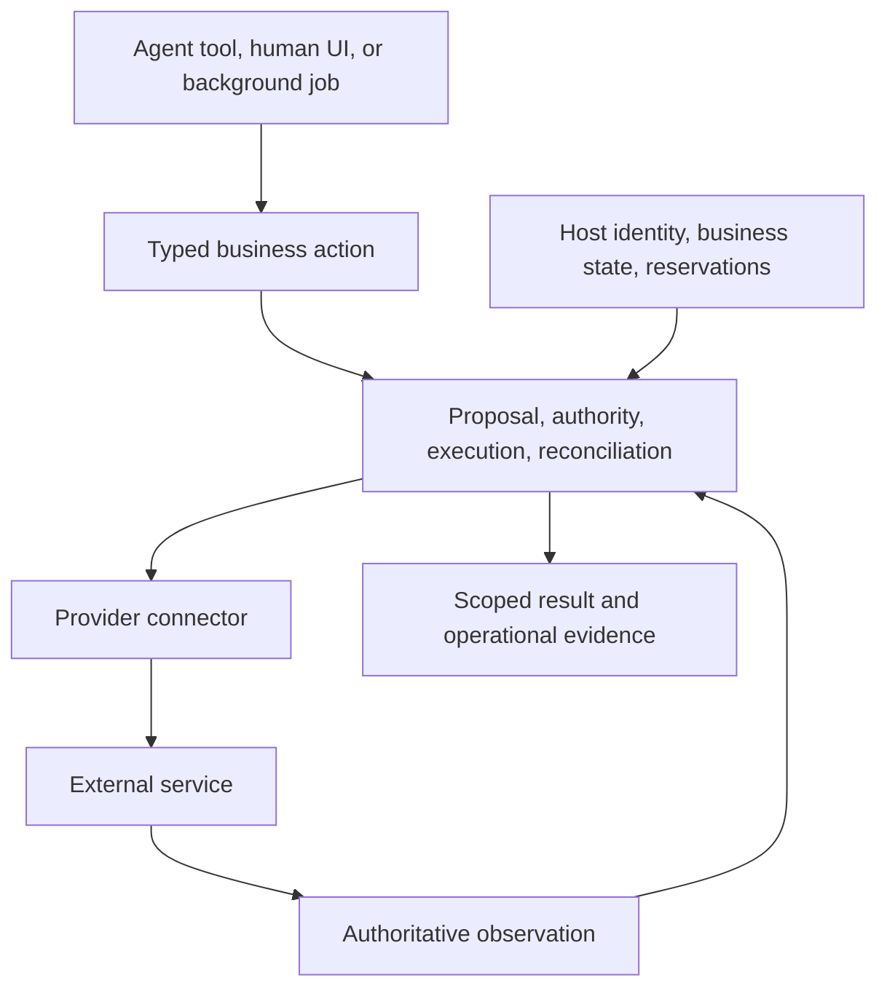

# Direction research: expert business actions for humans and agents

Date: 12/09/2026. Status: research and proposed direction; no implementation or roadmap approval implied.

## Recommendation

Build **a Python library that makes consequential business actions easier to define, authorize, operate, and verify**. Start with Stripe billing and support operations. Make the expertise in the lifecycle accessible through typed domain interfaces, reviewed host recipes, and executable conformance checks.

The opportunity is credible, but independent adoption is unproven. The differentiator to test is whether a developer can apply strong operational standards without becoming an expert in every failure mode. A shorter Stripe call, an approval dialog, or a larger connector catalog is insufficient differentiation.

Recommended product sentence:

> Threvo Actions helps developers give humans and agents controlled business actions, with approval tied to the intended change, recovery after uncertain execution, and explicit evidence of the outcome.

“Controlled” depends on the host implementing its contracts correctly. The library cannot guarantee business correctness, compliance, or exactly-once external effects on its own.

## Evidence and scope

The review covered the runtime, Stripe facade and host contracts, experimental inspection models, conformance helpers, reference refund application, target-client document, and existing adoption and roadmap records. The released `v0.3.2` source was used as the reference. The local checkout was behind remote `develop`; its runtime source differed from that tag only in the package version string. No branch update was needed for this research.

External research focuses on developments between 12/03/2025 and 12/09/2026, with current documentation used to check present capabilities. Announcements establish product direction, not independent demand for Threvo Actions. Older foundational material is identified separately. This is a strategic assessment, not a fresh security audit or a comparative implementation benchmark.

### What the code already gives us

| Evidence in the released code | Product significance | Boundary that remains |
| --- | --- | --- |
| [`ActionRuntime`](https://github.com/BlackPigIndustries/threvo-actions/blob/v0.3.2/src/threvo_actions/runtime.py) binds authority to a proposal and its committed state; checks expiry and live authorization around asynchronous work | Approval has a precise meaning even when time and business data change | The host must resolve authoritative state and identities correctly |
| Runtime admission and semantic effect identity, followed by reconciliation | Repeated requests and uncertain outcomes receive explicit lifecycle treatment | Provider behavior and host reservations still determine external-effect safety |
| [`StripeActions`](https://github.com/BlackPigIndustries/threvo-actions/blob/v0.3.2/src/threvo_actions/integrations/stripe/actions.py) composes typed operations on the shared runtime, with injectable clocks, events, and gateways | Domain convenience can preserve core guarantees and testability | Composition still requires substantial host infrastructure |
| [`RefundRepository.reserve`](https://github.com/BlackPigIndustries/threvo-actions/blob/v0.3.2/src/threvo_actions/integrations/stripe/ports.py) explicitly requires atomic comparison and coordination with all payment writers | The design recognizes the actual concurrency boundary | A Protocol cannot make an arbitrary database implementation atomic |
| [`ActionInspection`](https://github.com/BlackPigIndustries/threvo-actions/blob/v0.3.2/src/threvo_actions/experimental/inspection.py) is typed and allowlisted, and labels host coherence as unverified | There is already a foundation for honest machine-readable action descriptions | Static inspection does not qualify a live deployment |
| [`conformance.py`](https://github.com/BlackPigIndustries/threvo-actions/blob/v0.3.2/src/threvo_actions/conformance.py) and the [reference refund app](https://github.com/BlackPigIndustries/threvo-actions/tree/v0.3.2/examples/stripe_refunds) exercise stores, providers, recovery, and privacy boundaries | Expert knowledge can become runnable integration evidence | Reference implementations are not proof that an outside host has adopted the contracts correctly |

The [independent adoption ledger](https://github.com/BlackPigIndustries/threvo-actions/blob/v0.3.2/docs/testing/gradual-reveal-adoption.md) has no scored entries. That is the most important evidence gap for the product claim. Existing engineering work justifies testing adoption; it does not establish excellent external DX by itself.

## What the ecosystem changes

### Access, approval, and policy are increasingly supplied by others

Stripe currently provides agent plugins, an MCP server, skills, and machine-readable documentation. “Let an agent use Stripe” already has an official route. Our integration should demonstrate business lifecycle guarantees around selected operations. [Stripe agent documentation](https://docs.stripe.com/agents).

Pydantic AI already supports deferred tools and human approval. Its documentation also explicitly separates client-submitted approval from server-side authorization. This is a strong integration point: let the framework manage the conversation and require authenticated host authorization inside the action boundary. [Pydantic AI deferred tools](https://pydantic.dev/docs/ai/tools-toolsets/deferred-tools/).

AWS made AgentCore Policy generally available on 03/03/2026. Current documentation includes session-aware temporal policies, such as requiring prior approval or limiting aggregate activity. AWS described these capabilities on 06/08/2026. Therefore, positioning Threvo as merely an agent policy gate is vulnerable to both managed platforms and existing policy languages. [GA announcement](https://aws.amazon.com/about-aws/whats-new/2026/03/policy-amazon-bedrock-agentcore-generally-available/), [current policy concepts](https://docs.aws.amazon.com/bedrock-agentcore/latest/devguide/policy-core-concepts.html), [temporal policy article](https://aws.amazon.com/blogs/machine-learning/securing-ai-agents-with-temporal-policies-in-amazon-bedrock-agentcore/).

These sources describe overlapping capabilities; they do not prove competitors cannot implement our lifecycle. The competitive hypothesis is that our focused composition is easier to adopt and inspect in an existing Python application.

### Durable agents and business outcomes are complementary concerns

Pydantic AI documents durable execution integrations, and LangGraph documents checkpointing and recovery. Build on those orchestration systems where the host uses them. Avoid adding an agent runner or general workflow engine. [Pydantic AI durable execution](https://pydantic.dev/docs/ai/capabilities/durable_execution/overview/), [LangGraph persistence](https://docs.langchain.com/oss/python/langgraph/persistence).

A workflow can resume successfully while an external effect remains uncertain. Temporal’s explanation of activity retries and idempotency illustrates the underlying integration problem; this is foundational material from 2024, outside the trend window. Our proposed role is to encode domain identity, authority, and completion rules at that external-action boundary. [Temporal on idempotency and durable execution](https://temporal.io/blog/idempotency-and-durable-execution).

### Customer operations are a concrete application area

Intercom documents support automation that invokes external systems for refunds, subscription changes, and account updates, and now directs new automation authoring toward Procedures. This supports the relevance of the use cases, while also showing that complete support platforms are competitors for the overall workflow. A plausible distribution path is a host-owned action API behind an existing assistant. Building another support chat product would add a separate adoption problem. [Intercom’s current guidance](https://www.intercom.com/help/en/articles/9569407-fin-tasks-explained).

### Commerce protocols strengthen the authority theme, but change the integration problem

Google announced AP2 on 16/09/2025, Visa announced Trusted Agent Protocol on 14/10/2025, Stripe announced Agentic Commerce Suite on 11/12/2025, and Mastercard introduced Verifiable Intent on 05/03/2026. Together these are evidence of investment in agent commerce and explicit delegation. They are not evidence that networks need our current library. [Google AP2](https://cloud.google.com/blog/products/ai-machine-learning/announcing-agents-to-payments-ap2-protocol), [Visa announcement](https://visa.gcs-web.com/news-releases/news-release-details/visa-introduces-trusted-agent-protocol-ecosystem-led-framework), [Stripe announcement](https://stripe.com/newsroom/news/agentic-commerce-suite), [Mastercard announcement](https://www.mastercard.com/us/en/news-and-trends/stories/2026/verifiable-intent.html).

## Where we should fit

The best initial customer remains a Python SaaS or commerce engineering team that owns its application data, uses Stripe, and is putting customer-service or finance actions behind assistants. Its engineering lead owns reliability; support and operations staff use the results.

Good qualification signals are changing business state, separate request/approval authority, concurrent writers, and uncertainty after external submission. A team that only needs an ordinary SDK call or a dashboard operation has little reason to adopt the full runtime.

Consider a support assistant proposing a refund. The useful expertise concerns whether approval still covers the current payment, whether another channel already acted, whether a timeout means failure, and what evidence permits reporting completion. These problems also occur with human interfaces and background jobs. The same action boundary should serve all three.

The reusable asset is the combination of lifecycle behavior, provider-specific knowledge, integration recipes, and tests that expose incorrect host assumptions. Individual mechanisms are established engineering practice. Their composition and accessibility must earn adoption.

### Stripe, Visa, and Mastercard

| Ecosystem | Plausible relationship | Recommended investment |
| --- | --- | --- |
| Stripe | Govern selected billing/support actions over the SDK. Existing payment activity, including agent-originated commerce, can create downstream servicing needs | Deepen refunds, cancellations, and credit notes through real host adoption before adding broad API coverage |
| Visa Trusted Agent Protocol | Verify signed agent/consumer/payment context at a merchant-facing ingress boundary | Defer until a customer needs agent checkout or purchasing; agent recognition alone does not authorize an internal refund |
| Mastercard Verifiable Intent / AP2 | Verify external delegation, then apply local company policy and bind the permitted action to business state | A bounded authority-adapter experiment after a named design partner supplies the use case and test environment |

Visa’s specifications cover signed recognition and payment context. Our ingress-adapter suggestion is an architectural inference, not existing interoperability. [Visa specifications](https://developer.visa.com/capabilities/trusted-agent-protocol/trusted-agent-protocol-specifications).

The Verifiable Intent repository currently labels its specification Draft v0.1 and includes a Python reference implementation for delegation and constraint verification. Reuse maintained verification work when qualified; do not invent competing credential cryptography. Any bridge needs explicit trust, audience, expiry, constraint, and applicable revocation handling before translating external evidence into local authority. [Verifiable Intent specification and reference implementation](https://github.com/agent-intent/verifiable-intent/).

There is no automatic network partnership, certification, or standards compatibility from having typed authority evidence. Corporate purchasing would also introduce budget reservation and order/payment binding beyond the present billing-action scope.

## What to build next

### 1. Make host correctness easier to achieve

Start from the existing PostgreSQL reference work. Produce a reviewed recipe that shows how action reservations coexist with an application's ordinary writers, transaction boundaries, tenant scope, and existing authorization. Add a host conformance exercise that runs against the adopter’s database implementation.

The exercise should cover concurrent requests, stale approvals, permission revocation, a crash after provider acceptance, ambiguous reservation acknowledgement, and writes through another application path. A library-only fake test cannot establish the host’s transactional behavior.

Keep the infrastructure reusable across multiple actions. Do not force an ORM or application database model into the core. If two hosts share enough wiring, extract the repeated portion into an optional adapter after demonstrating that overlap.

### 2. Make uncertain outcomes operable

The reference application already has due-work discovery and sweeps. Use an outside integration to decide whether the public contract needs a discovery interface or a documented projection/outbox recipe is sufficient.

An operator and an agent should be able to determine what is waiting, why it is waiting, what can safely happen next, and when intervention is required. Preserve historical receipts when adding late evidence. A manual-resolution interface must not become an unrestricted “mark successful” or “retry anyway” escape hatch.

Show recovery with one existing host scheduler or workflow system. This is an integration deliverable, not a proposal to create a scheduler.

### 3. Add a small semantic action catalog

The ontology idea is useful at the level of explicit business semantics. Palantir already demonstrates actions whose eligibility depends on user properties and business objects; this is an established pattern, not an unoccupied category. [Palantir action submission criteria](https://www.palantir.com/docs/foundry/action-types/submission-criteria).

Extend the existing experimental inspection design only where an actual tool consumer needs more information. Candidate concepts are affected resource types, intended effect, input/result schemas, approval requirements, completion criteria, and permitted recovery behavior. Keep private snapshots and sensitive host references out of the projection.

Use Pydantic for validated boundary data and generated schemas; keep dependencies and behavior in typed Python ports. YAML may load the same configuration models, but it cannot establish live authorization, transactional isolation, or verifier correctness. Separate declared requirements from runtime observations and independently demonstrated properties.

A catalog can help agents choose and explain actions. It should not authorize them. A general ontology framework would require a much broader commitment to identity, relationships, queries, migrations, and synchronization; there is no adoption evidence here to justify that expansion yet.

### 4. Prove one nonfinancial action before adding a connector portfolio

| Candidate | Why it could reuse the expertise | Qualification needed | Priority |
| --- | --- | --- | --- |
| Customer entitlement suspension/restoration through a host API | Same SaaS buyer; precise permission changes; important live state and completion semantics | Define whether completion means a persisted entitlement or enforced access, including relevant caches/sessions | First nonfinancial pilot, conditional on a partner |
| Bounded CRM account-status or ownership change | Approval and stale-state handling apply to operational data changes | Authoritative revision and conflict behavior; begin with bounded updates before merge/deletion | Second candidate |
| Production change approval and execution | Exact revision/environment binding and verification are relevant | Establish value beyond the host’s existing deployment controls | Later, demand-driven |
| Generic messaging or document CRUD | Easy to demonstrate connectivity | Insufficient evidence that our full lifecycle earns its adoption cost | Defer |

These are proposed investigations, not claims of connector compatibility. Choose one concrete operation with a buyer and a verifiable postcondition. An internal API connector can demonstrate portability before another vendor package is justified.

## Proposed 90-day evidence pipeline

The phases are sequential and gated. Timing is an allocation proposal, not a delivery commitment.

| Phase | Work and deliverable | Exit evidence |
| --- | --- | --- |
| Weeks 1–2: validate the problem | Observe three outside Python teams walking through an existing consequential action and its failure handling; compare their SDK/framework approach with ours | At least two teams identify a specific recurring responsibility they want the library to own; document rejection reasons too |
| Weeks 3–5: qualify the host path | One reviewed database recipe, host conformance scenarios, and a documented recovery loop | An outside team integrates a Stripe action and demonstrates the selected failure cases; record assistance and remaining host obligations |
| Weeks 6–8: establish repeat use and comprehension | The same team adds a second action; test the existing API and a minimal descriptor with human and agent consumers | Correct interpretation of authority, affected data, pending results, and recovery; shared infrastructure is reused without bypassing controls |
| Weeks 9–12: test expansion | Implement one partner-backed nonfinancial action using the existing lifecycle | Evidence that the core generalizes without vendor-specific branches or unrelated abstractions; decide whether to expand or deepen Stripe |

Use correctness, comprehension, diagnosability, and repeat adoption as the primary product measures. Measure elapsed time and wiring as supporting evidence. The existing formal adoption gates remain in force; changing that methodology requires an explicit versioned decision, not silently treating these proposed experiments as passing ledger entries.

Do not expand merely because a tutorial succeeds. If adopters still need comparable bespoke recovery and reservation machinery, improve that boundary. If their existing SDK plus framework already meets their needs comfortably, narrow the target segment. If a second action needs another framework-sized integration, reconsider the abstraction before adding vendors.

Preserve the supported API while collecting this evidence. Keep new declarations experimental, and keep provider packages optional. Consider splitting `threvo-actions-stripe` when independent dependencies, release cadence, or a second proven connector makes the maintenance benefit concrete.

The nearest commercial experiment is implementation and operational support for a qualified host. A hosted recovery/evidence product is a later hypothesis, conditional on repeated demand; there is no demonstrated revenue model in the inspected evidence. The immediate objective is that outside developers can apply the standards correctly and choose to use the library again.
